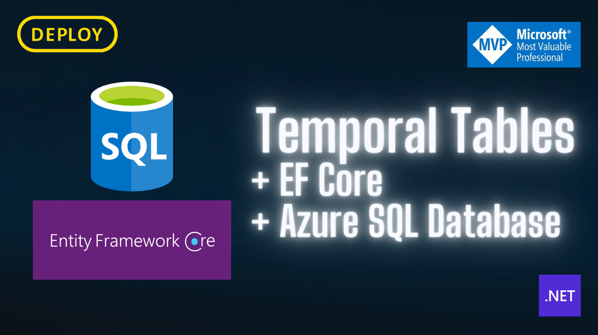

# Temporal Tables



## Pre req
```bash
dotnet tool install --global dotnet-ef
```

## Commands
```bash
$env:MigrationName  = "InitDatabaseCommit";
```

Criação do arquivo de Migration
```
dotnet ef migrations `
add $env:MigrationName `
--startup-project ./src/DEPLOY.TemporalTables.EF `
--project ./src/DEPLOY.TemporalTables.EF `
--context DEPLOY.TemporalTables.EF.Infra.Database.Persistence.DeployDbContext `
--output-dir Migrations/EF `
--verbose
```

Aplicando o arquivo de Migration gerado
```
dotnet ef database `
update $env:MigrationName `
-s ./src/DEPLOY.TemporalTables.EF `
-p ./src/DEPLOY.TemporalTables.EF `
-c DEPLOY.TemporalTables.EF.Infra.Database.Persistence.DeployDbContext `
-v
```


```
dotnet ef migrations script `--project ./src/DEPLOY.TemporalTables.EF`
-o ./src/DEPLOY.TemporalTables.EF/Migrations/SQL/$env:MigrationName.sql
```

## Como deletar as tabelas criadas

````sql
ALTER TABLE [dbo].[Contratos] SET (SYSTEM_VERSIONING = OFF);
ALTER TABLE [dbo].[Pessoas] SET (SYSTEM_VERSIONING = OFF);

DROP TABLE [dbo].[ContratosHistory]
DROP TABLE [dbo].[HistoricoTabelaPessoa]

DROP TABLE [dbo].[Contratos]
DROP TABLE [dbo].[Pessoas]

DROP TABLE [dbo].[_ControleMigracoes]
````

## Connection String
```
Server=tcp:azuresqledge.database.windows.net,1433;Initial Catalog=daploy-ef-analizer;Persist Security Info=False;User ID=felipementel;Password=Abcd1234%;MultipleActiveResultSets=False;Encrypt=True;TrustServerCertificate=False;Connection Timeout=30;
```


## Docker - SQL Edge
```
https://learn.microsoft.com/en-us/azure/azure-sql-edge/disconnected-deployment
```

```
sudo docker run \
--cap-add SYS_PTRACE \
-e 'ACCEPT_EULA=1' \
-e 'MSSQL_SA_PASSWORD=Abcd1234%' \
-e MSSQL_AGENT_ENABLED=True \
-e ClientTransportType=AMQP_TCP_Only \
-e PlanId=asde-developer-on-iot-edge \
-p 1433:1433 \
--name azuresqledge \
-d \
mcr.microsoft.com/azure-sql-edge/developer
mcr.microsoft.com/azure-sql-edge
```

```
sudo docker run \
--cap-add SYS_PTRACE \
-e 'ACCEPT_EULA=1' \
-e 'MSSQL_SA_PASSWORD=Abcd1234%' \
-p 1433:1433 \
--name azuresqledge \
-d \
mcr.microsoft.com/azure-sql-edge
```

<details>
<summary>SQL EDGE</summary>
<p>

#### Show Paths Button

```docker
sudo docker exec -it azuresqledge "bash"
```

```bash
/opt/mssql-tools/bin/sqlcmd -S localhost -U SA -P "Abcd1234%"
```

```sql
SELECT name from sys.databases;
```

#### Show Paths View

</p>
</details>


```
IF EXISTS (SELECT * FROM sys.objects WHERE type = 'P' AND name = 'GetMostPopularBlogsByName')
BEGIN
    DROP PROCEDURE dbo.GetMostPopularBlogsByName;
END
GO

CREATE PROCEDURE dbo.GetMostPopularBlogsByName
    @filterByUser NVARCHAR(100)
AS
BEGIN
    SET NOCOUNT ON;

    SELECT
       [PessoaId]
      ,[Nome]
      ,[Email]
      ,[Telefone]
      ,[Documento]
      ,[Endereco]
      ,[DataNascimento]
      ,[CreatedAt]
      ,[UpdatedAt]
      ,[PeriodStart]
      ,[column-fim]
    FROM
        [dbo].[Pessoas]
    WHERE
        [Nome] LIKE @filterByUser + '%'
    ORDER BY
        [CreatedAt] DESC;
END;

-- EXECUTE dbo.GetMostPopularBlogsByName @filterByUser=CANAL

```

## Docs EF Core

```
https://learn.microsoft.com/en-us/sql/relational-databases/tables/temporal-tables?view=sql-server-ver16
```

```
https://learn.microsoft.com/en-us/ef/core/providers/sql-server/temporal-tables
```

```
https://devblogs.microsoft.com/dotnet/prime-your-flux-capacitor-sql-server-temporal-tables-in-ef-core-6-0/
```